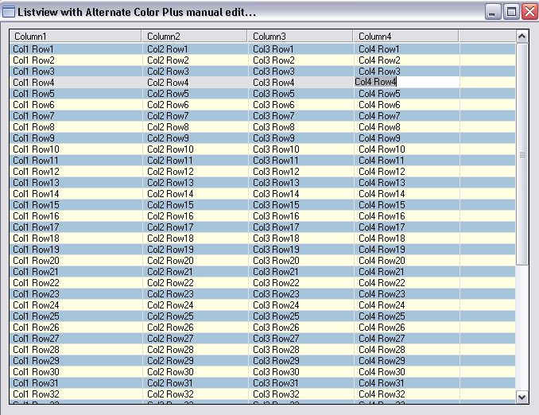



## Listview alternate color, manual edit, with textbox

### Description

A basic listview manipulation, wherein you can use manual edit on every column and row by double clicking the specified cell. You can edit and delete the text on a cell, set alternate background to every row. I am just sharing... For some instance that i have similar codes to you that doesn't mean that I copied your code. I have coded this on my own and I already give comments to some author. If you like this code please vote...
 
### More Info
 

             |
---                |---
**Submitted On**   |2010-07-15 15:39:10
**By**             |[Otrebor](https://github.com/Planet-Source-Code/PSCIndex/blob/master/ByAuthor/otrebor.md)
**Level**          |Intermediate
**User Rating**    |4.4 (22 globes from 5 users)
**Compatibility**  |VB 6\.0
**Category**       |[Custom Controls/ Forms/  Menus](https://github.com/Planet-Source-Code/PSCIndex/blob/master/ByCategory/custom-controls-forms-menus__1-4.md)
**World**          |[Visual Basic](https://github.com/Planet-Source-Code/PSCIndex/blob/master/ByWorld/visual-basic.md)
**Archive File**   |[Listview\_a2185327272010\.zip](https://github.com/Planet-Source-Code/otrebor-listview-alternate-color-manual-edit-with-textbox__1-73301/archive/master.zip)

